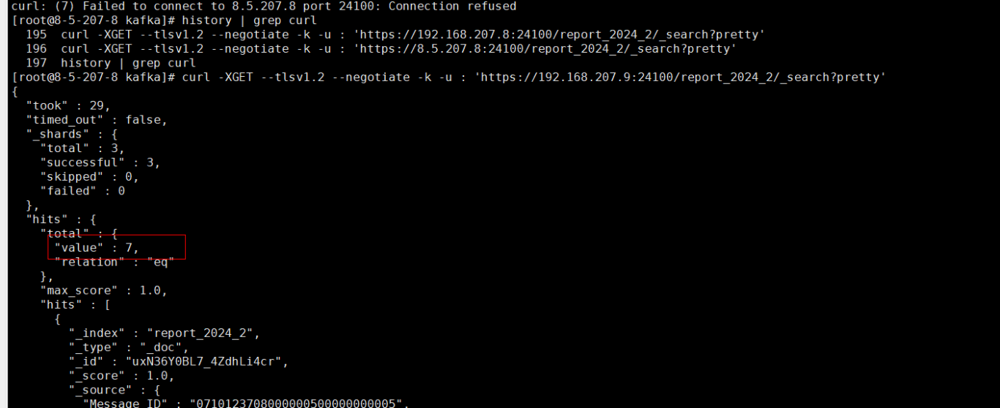

## 样例说明
该样例代码使用spark streaming读取安全kafka两个topic的数据分别写入hbase两张表，hdfs两个表以及es攒批方式写入两个索引

### 一、kafka数据源
1、kafka数据源样例
参考本样例conf/目录下 DetailData2024-02-26.txt 和 ReportData2024-02-26.txt。

2、创建两个topic detaildata和reportdata

a. 创建detaildata和reportdata 两个topic, 注意修改对应kafka的broker节点ip
```shell
./bin/kafka-topics.sh --create --topic detaildata --partitions 3 --replication-factor 2 --bootstrap-server 192.168.207.8:21007 --command-config config/client.properties
./bin/kafka-topics.sh --create --topic reportdata --partitions 3 --replication-factor 2 --bootstrap-server 192.168.207.8:21007 --command-config config/client.properties
```

b. 查看topic
```shell
./bin/kafka-topics.sh --list --bootstrap-server 192.168.207.8:21007 --command-config config/client.properties
```

c. 查看topic详情
```shell
./bin/kafka-topics.sh --describe --topic detaildata --bootstrap-server 192.168.207.8:21007 --command-config config/client.properties
./bin/kafka-topics.sh --describe --topic reportdata --bootstrap-server 192.168.207.8:21007 --command-config config/client.properties
```
d. 查看消费情况
```shell
./bin/kafka-consumer-groups.sh --describe --bootstrap-server 192.168.207.8:21007 --group testWriteHBaseEsHdfs  --command-config config/consumer.properties
```

e. 添加consumer权限
```shell
bin/kafka-acls.sh --bootstrap-server 192.168.207.8:21007  --command-config config/client.properties --add --allow-principal User:sandbox --consumer --topic detaildata --group testWriteHBaseEsHdfs
bin/kafka-acls.sh --bootstrap-server 192.168.207.8:21007  --command-config config/client.properties --add --allow-principal User:sandbox --consumer --topic reportdata --group testWriteHBaseEsHdfs
```

f. 添加producer权限
```shell
bin/kafka-acls.sh --bootstrap-server 192.168.207.8:21007 --command-config config/client.properties --add --allow-principal User:sandbox --producer --topic detaildata
bin/kafka-acls.sh --bootstrap-server 192.168.207.8:21007 --command-config config/client.properties --add --allow-principal User:sandbox --producer --topic reportdata
```

### 二、准备工作
1、FI上创建sandbox用户, 需要有kafka、hive、hbase、es、hadoop等组件操作权限


2、登录spark客户端所在节点，编译本样例并上传 SparkOnStreamingToESHdfsHBaseExample-1.0.jar 到 /opt/sandbox下(需要创建该目录)

3、下载sandbox用户的凭证zip, 上传到 /opt/sandbox下, 解压zip后得到 user.keytab 和 krb5.conf文件

4、/opt/sandbox下, 准备es配置文件esParams.properties,参考本样例conf/目录下esParams.properties, 注意esServerHost修改成对应es的服务节点ip

5、/opt/sandbox下, 创建conf/目录, 将esParams.properties、krb5.conf、user.keytab拷贝放入/opt/sandbox/conf/下

6、/opt/sandbox下, `zip conf.zip esParams.properties krb5.conf user.keytab`, 在/opt/sandbox下生成 conf.zip文件

7、从spark客户端拷贝jar包到 /opt/sanbox/jars目录下
```shell
cp $SPARK_HOME/spark/jars/streamingClient010/kafka-clients-2.8.1-h0.cbu.mrs.331.r1-SNAPSHOT.jar /opt/sanbox/jars/
cp $SPARK_HOME/spark/jars/streamingClient010/spark-streaming-kafka-0-10_2.12-3.3.1-h0.cbu.mrs.331.r1-SNAPSHOT.jar /opt/sanbox/jars/
cp $SPARK_HOME/spark/jars/streamingClient010/spark-token-provider-kafka-0-10_2.12-3.3.1-h0.cbu.mrs.331.r1-SNAPSHOT.jar /opt/sanbox/jars/
```

8、修改spark客户端下的jaas.conf和jaas-zk.conf文件, 分别追加KafkaClient项
```
cd $SPARK_HOME/conf/
# vim jaas.conf 追加 KafkaClient
KafkaClient {
com.sun.security.auth.module.Krb5LoginModule required
useKeyTab=false
useTicketCache=true
debug=false;
};

# vim jaas-zk.conf 追加 KafkaClient
KafkaClient {
com.sun.security.auth.module.Krb5LoginModule required
useKeyTab=true
keyTab="./user.keytab"
principal="sandbox@HADOOP.COM"
useTicketCache=false
storeKey=true
debug=true;
};
```

注：

1、ES默认会获取运行当前目录的conf下获取配置文件进行认证，需要三个文件esParams.properties、krb5.conf、user.keytab

2、/opt/sandbox下准备好如下文件


### 三、提交spark-submit作业
```shell
source $BIGDATA_HOME/bigdata_env

kinit sandbox

cd /opt/sandbox

spark-submit --master yarn-client --files ./user.keytab --class com.huawei.bigdata.spark.examples.streaming.SparkOnStreamingToESHdfsHBaseExample --keytab /opt/sandbox/user.keytab --principal sandbox --archives /opt/sandbox/conf.zip#conf --jars /opt/sandbox/jars/kafka-clients-2.8.1-h0.cbu.mrs.331.r1-SNAPSHOT.jar,/opt/sandbox/jars/spark-streaming-kafka-0-10_2.12-3.3.1-h0.cbu.mrs.331.r1-SNAPSHOT.jar,/opt/sandbox/jars/spark-token-provider-kafka-0-10_2.12-3.3.1-h0.cbu.mrs.331.r1-SNAPSHOT.jar /opt/sandbox/SparkOnStreamingToESHdfsHbaseExample-1.0.jar /tmp detaildata,reportdata 192.168.207.8:21007
```

### 四、生产kafka数据源
开两个shell窗口, 分别向kafka的detaildata以及reportdata写入数据, 进入shell窗口后, 粘贴提前准备好的 DetailData2024-02-26.txt 和 ReportData2024-02-26.txt 中的文本内容。
```shell
./bin/kafka-console-producer.sh --broker-list 192.168.207.8:21007 --topic detaildata --producer.config config/producer.properties

./bin/kafka-console-producer.sh --broker-list 192.168.207.8:21007 --topic reportdata --producer.config config/producer.properties
```

### 五、测试验证
1、spark-streaming验证


2、hbase验证
```shell
#登录hbase
hbase shell
#scan表, 注意执行的月份为当前年月, 例如当前月为2月, 则scan命令如下
scan "detail_2024_2"
scan "report_2024_2"
```


3、spark-sql验证
```shell
CREATE external TABLE detail_table( date varchar(128), gateway_name varchar(128), enterprise_code varchar(128), business_code varchar(128), service_code varchar(128), send_direction varchar(128)) stored as parquet location '/sandbox/detail_data';

CREATE external TABLE report_table( gatewayname varchar(128), message_id varchar(128), message_type varchar(128), calling_number varchar(128), called_number varchar(128), submission_time varchar(128), final_end_time varchar(128), message_status varchar(128), message_status_description varchar(128), message_length varchar(128), details varchar(128)) stored as parquet location '/sandbox/report_data';
```


4、spark-shell验证
```scala
val parqDF = spark.read.parquet("/sandbox/detail_data")
parqDF.createOrReplaceTempView("ParquetTable")
spark.sql("select * from ParquetTable").explain()
val parkSQL = spark.sql("select * from ParquetTable")
parkSQL.show()

val parqDF = spark.read.parquet("/sandbox/report_data") 
parqDF.createOrReplaceTempView("ParquetTable") 
spark.sql("select * from ParquetTable").explain() 
val parkSQL = spark.sql("select * from ParquetTable") 
parkSQL.show()
```


5、es验证
```shell
# 注意填写es的server ip, 注意执行的月份为当前年月, 例如当前月为2月, 则scan命令如下
curl -XGET --tlsv1.2 --negotiate -k -u : 'https://192.168.207.9:24100/report_2024_2/_search?pretty'
curl -XGET --tlsv1.2 --negotiate -k -u : 'https://192.168.207.9:24100/detail_2024_2/_search?pretty'
```


